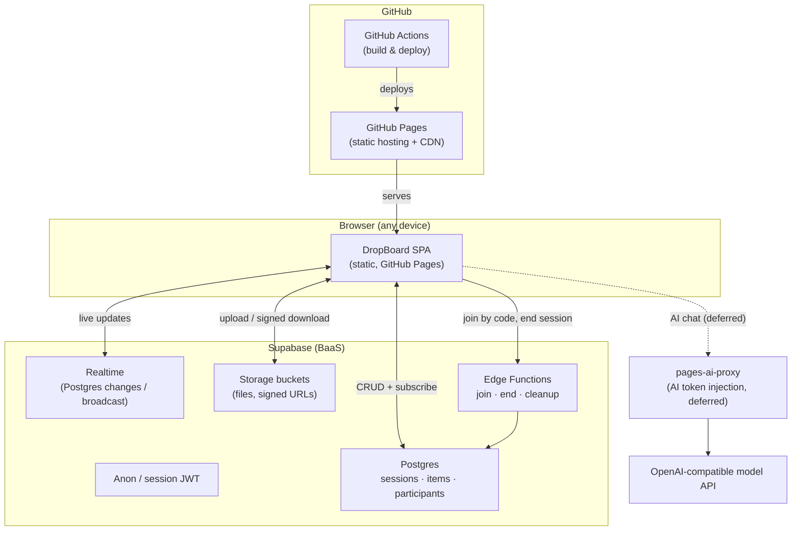

# DropBoard — Product Design & Engineering Guidelines

> **Status:** Draft for build. This document turns the [README](../README.md) concept brief
> into concrete front-end and back-end guidelines plus a deployable architecture.
>
> **Deployment stance (decided):**
> - **Front end** ships as a static single-page app on **GitHub Pages**.
> - **Back end** is **Supabase** (Postgres + Realtime + Storage + Edge Functions) — a BaaS,
>   so there is no server for us to operate.
> - **AI** calls (deferred — no product AI features this iteration) route through the
>   [`pages-ai-proxy`](https://github.com/Ethical-Tech-CoLab/pages-ai-proxy) so a provider
>   token never ships to the browser. It is wired and configured but not yet used by a feature.

---

## 1. Product summary

DropBoard is a zero-friction, ephemeral "drop-space": start a session, share a short access
code, and everyone who joins can drop files / links / text onto one shared board and grab each
other's items in real time. Boards auto-expire. No accounts.

The three product pillars from the README drive every guideline below:

1. **Zero friction** — usable board in < 10s, no signup ever.
2. **Ephemeral first** — expiry is a feature; nothing lingers.
3. **Device-agnostic** — mobile is first-class, not an afterthought.

---

## 2. Architecture

### 2.1 System diagram



### 2.2 Why this shape

- **GitHub Pages is static** — it cannot hold a secret or run server code. Everything dynamic
  lives in Supabase (which the browser talks to directly with a *public* anon key, guarded by
  Row Level Security) or in the AI proxy (which holds the model token server-side).
- **No servers to run.** Supabase and the proxy are both managed. Ops surface is near-zero,
  which fits an ephemeral, low-cost product.
- **The anon key is not a secret.** It is safe to ship. All access control is enforced by
  **RLS policies** and by short-lived **session tokens** minted by an Edge Function — see §4.

### 2.3 Request lifecycle (happy path)

1. User opens the Pages URL → SPA loads (static, cached on CDN).
2. **Create session** → SPA calls the `create-session` Edge Function → row in `sessions`,
   returns `{ session_id, access_code, session_token }`.
3. **Join by code** → SPA calls `join-session` with the code → validates + returns a scoped
   `session_token` (short-lived JWT carrying the `session_id` claim).
4. **Drop an item** → file uploads to Storage under `sessions/<id>/…`; a row is inserted into
   `items`. Realtime broadcasts the insert to every subscriber.
5. **Grab an item** → SPA requests a signed download URL (short TTL) for the file.
6. **Session ends** (timer or manual) → `end-session` flips state; the scheduled `cleanup`
   function deletes expired sessions' rows + storage objects.

---

## 3. Front-end guidelines

### 3.1 Stack & structure

- **Framework:** Start framework-light. A small Vite + vanilla-TS (or Preact/Svelte) SPA keeps
  the bundle tiny and the < 10s-to-usable goal realistic. Avoid heavy state libraries.
- **Build output is fully static** — no SSR, no server routes. Everything runs in the browser.
- **Base path:** the app is served from `https://<owner>.github.io/<repo>/`. Configure the
  bundler `base` accordingly and use a hash or history router that respects the sub-path.
- **Suggested layout:**
  ```
  web/
    index.html          # entry
    config.js           # runtime config (proxy + supabase URLs, anon key) — NON-secret
    src/
      board/            # board view, item cards, drop zone
      session/          # create/join/end flows
      lib/
        supabase.js     # client init + realtime subscription helpers
        ai.js           # pages-ai-proxy client (wired, unused for now)
        storage.js      # upload + signed-URL download
  ```

### 3.2 State & realtime

- **Single source of truth = Supabase.** Local state is a cache of the `items` table for the
  current session. Subscribe to Realtime and reconcile on every insert/update/delete.
- **Optimistic UI** for drops: render the card immediately with a "uploading" state, confirm
  on the DB insert, roll back visibly on failure.
- **Reconnect gracefully.** On websocket drop, re-fetch the item list once and re-subscribe;
  never assume the live stream never gaps.

### 3.3 Interaction & input

- **Drag-and-drop + tap-to-upload + clipboard paste** must all funnel into one `addItem()`
  path. Detect item type (file / URL / text) centrally, not per input surface.
- **Links** render as cards; fetch title/favicon best-effort (see §4.6 — do it server-side or
  tolerate CORS failures gracefully; never block the drop on preview fetching).
- **Big/slow uploads:** show per-file progress, allow cancel, enforce the size cap client-side
  *before* upload (mirror the server cap — client checks are UX, server checks are truth).

### 3.4 Mobile & accessibility (first-class, not optional)

- Design mobile-first; the join flow (enter code → board) must work one-handed on a phone.
- Tap targets ≥ 44px. The board must be scannable on a projector (large, high-contrast cards).
- Full keyboard operability; visible focus states; `aria` labels on drop zones and item
  actions; respect `prefers-reduced-motion` and `prefers-color-scheme`.
- Copy-to-clipboard and download actions must have non-drag fallbacks (buttons), since drag
  doesn't exist on touch.

### 3.5 Performance

- Ship < ~150KB JS on first load; lazy-load anything non-critical (e.g. QR generation).
- Thumbnail/preview images lazily; cap rendered item count with virtualization if a board
  grows large.
- Treat the CDN cache as a feature: fingerprint assets, long-cache them, and keep `index.html`
  short-cached so deploys roll out promptly.

### 3.6 Front-end security hygiene

- **Never put a real secret in the front end.** The Supabase anon key is public-by-design; the
  AI provider token lives only in the proxy. If a value must be hidden, it goes server-side.
- **Sanitize all rendered content.** Dropped text and link titles are untrusted — escape on
  render, never `innerHTML` raw input. Open external links with `rel="noopener noreferrer"`.
- Treat the access code like a meeting link (see README): it's a low barrier, not a password.
  Warn users before they drop anything sensitive.

---

## 4. Back-end guidelines (Supabase)

### 4.1 Data model

```sql
-- sessions: one row per board
create table sessions (
  id           uuid primary key default gen_random_uuid(),
  access_code  text unique not null,          -- human-readable, e.g. TIGER-42
  created_at   timestamptz not null default now(),
  expires_at   timestamptz not null,          -- timer-based end
  ended_at     timestamptz,                   -- set when ended manually
  status       text not null default 'active' -- active | ended | expired
);

-- items: one row per dropped artifact
create table items (
  id          uuid primary key default gen_random_uuid(),
  session_id  uuid not null references sessions(id) on delete cascade,
  kind        text not null,                  -- file | link | text
  content     jsonb not null,                 -- {text} | {url,title,favicon} | {name,size,path}
  created_at  timestamptz not null default now(),
  created_by  text                            -- optional display name (attribution)
);

-- participants: optional, for presence / attribution
create table participants (
  id          uuid primary key default gen_random_uuid(),
  session_id  uuid not null references sessions(id) on delete cascade,
  display_name text,
  joined_at   timestamptz not null default now()
);

create index on items (session_id, created_at);
```

### 4.2 Access control — the core rule

The anon key is public, so **RLS is the security boundary**. The scheme:

- An **Edge Function mints a short-lived JWT** carrying a `session_id` claim after validating
  the access code (`create-session` / `join-session`). The browser uses that token for DB and
  Realtime calls.
- **RLS policies scope every table to the token's `session_id`** — a participant can only read
  and write rows for the session they actually joined. Knowing one code never exposes another
  board.

```sql
alter table items enable row level security;

create policy "read items in my session" on items
  for select using (session_id = (auth.jwt() ->> 'session_id')::uuid);

create policy "insert items in my session" on items
  for insert with check (session_id = (auth.jwt() ->> 'session_id')::uuid);
```

> **Guideline:** never rely on the client to filter by session. If a query isn't constrained
> by an RLS policy, assume it's readable by anyone with the anon key.

### 4.3 Realtime

- Enable Realtime on `items` (and optionally `participants` for presence).
- Clients subscribe filtered by `session_id`. RLS applies to Realtime too — verify a token for
  session A cannot receive session B's changes.

### 4.4 File storage

- One bucket, path-namespaced per session: `sessions/<session_id>/<item_id>/<filename>`.
- **Uploads:** authorized by the session JWT + a Storage RLS policy on the path prefix.
- **Downloads:** always via **short-TTL signed URLs** (minutes, not hours). Never make the
  bucket public.
- **Size + type limits enforced server-side** (bucket policy / Edge Function), mirrored in the
  client for UX. Client limits are advisory; the server limit is authoritative.

### 4.5 Lifecycle & ephemerality (the product's defining behavior)

- **Timer end:** `expires_at` set at creation (default per README open question — start with a
  4h "meeting length" default, configurable).
- **Manual end:** `end-session` sets `ended_at` + `status='ended'`.
- **Cleanup:** a scheduled job (Supabase `pg_cron` or a scheduled Edge Function) runs
  frequently, and for any session past `expires_at` or ended: deletes its Storage objects, then
  its rows (cascade handles `items`/`participants`). **Storage is not transactional with the
  DB — delete objects first, then rows, and make cleanup idempotent/retry-safe.**
- **End-of-session "save everything" (planned):** before deletion, each participant may be
  offered a one-click export (zip of files + a manifest of links/text). Because export needs
  the objects to still exist, run it against live signed URLs *before* cleanup, on the client.
  This is the "Extend/save" nice-to-have from the README — tracked in the backlog.

### 4.6 Link previews

- Fetching a page title/favicon from the browser is blocked by CORS for most sites. Do it in a
  lightweight `link-preview` Edge Function (server-side fetch, sanitize, return title+favicon),
  or degrade gracefully to showing the bare URL. Never block the drop on preview success.

### 4.7 Abuse & limits

- **Rate-limit** session creation and joins (per IP) at the Edge Function layer.
- **Unguessable codes:** dictionary-word + number *plus* enough entropy to resist enumeration;
  rate-limit join attempts to blunt brute force.
- **Size/type screening** on upload; reject executables/oversized files server-side.

---

## 5. AI proxy configuration (wired, features deferred)

Per this iteration's decision, DropBoard does **not** ship an AI feature yet, but the proxy is
configured so a future feature (e.g. link summaries, board assistant, safety screening) is a
drop-in.

**Simple configuration — two steps:**

1. **Point the front end at the deployed proxy.** In [`web/config.js`](../web/config.js):
   ```js
   window.DROPBOARD_CONFIG = {
     AI_PROXY_URL: "https://YOUR-PROXY/v1/chat/completions", // set to the deployed proxy
     AI_MODEL: "openai/gpt-4o-mini",
     // ...supabase config below
   };
   ```
2. **Allow the Pages origin on the proxy.** On the *proxy* side (already deployed — we do not
   rebuild it), add this app's origin to `ALLOWED_ORIGINS`, e.g.
   `https://<owner>.github.io`. The proxy injects the provider token and adds CORS headers; the
   browser sends **no** `Authorization` header.

The client wrapper ([`web/src/lib/ai.js`](../web/src/lib/ai.js)) is an OpenAI-style call with
the base URL swapped to the proxy — ready to use the moment a feature needs it.

---

## 6. Deployment

### 6.1 GitHub Pages (front end)

- A GitHub Actions workflow ([`.github/workflows/deploy-pages.yml`](../.github/workflows/deploy-pages.yml))
  builds/publishes the `web/` directory to Pages on push to the default branch.
- Enable Pages with **"GitHub Actions"** as the source (not the legacy branch source).
- Runtime config (`config.js`) is **non-secret** (anon key + public proxy URL), so it can live
  in the repo. Real secrets never touch the front end.

### 6.2 Supabase (back end)

- Provision a project; apply the schema + RLS + policies (§4) via migrations.
- Deploy Edge Functions: `create-session`, `join-session`, `end-session`, `cleanup`,
  `link-preview`.
- Configure Storage bucket + policies; schedule `cleanup`.

### 6.3 Environments

- Use two Supabase projects (dev + prod) and two `config.js` values. Keep the proxy's
  `ALLOWED_ORIGINS` limited to the exact Pages origins in production.

---

## 7. Open questions (from README, with a recommended default)

| Question | Recommended starting answer |
|---|---|
| Do session creators get special powers? | Yes, minimally: creator can **end** the session; item deletion stays open to all (revisit). |
| Default expiry? | **4h** "meeting length" default, user-selectable up to 24h. |
| File size cap? | Start **25 MB/file** on free tier; revisit against Supabase Storage limits. |
| Moderation for leaked codes? | Rate-limit + size/type screening now; lightweight report action in backlog. |

---

## 8. Security & privacy summary

- Access code = low barrier, treated like a meeting link; users warned before dropping secrets.
- Anon key public by design; **RLS + per-session JWT** are the real boundary.
- Files via short-TTL signed URLs only; buckets never public.
- HTTPS everywhere; auto-deletion on expiry; no long-term retention; no user database.
- AI provider token lives only in the proxy, never in the browser.
```